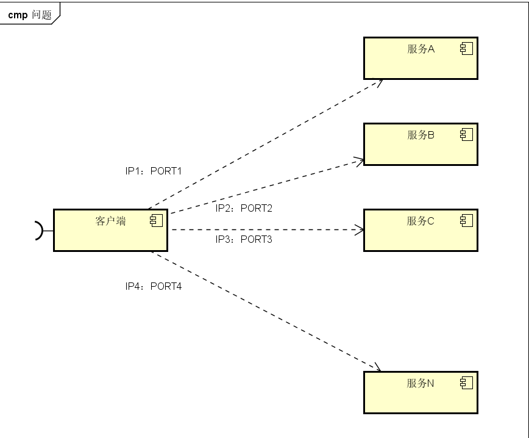
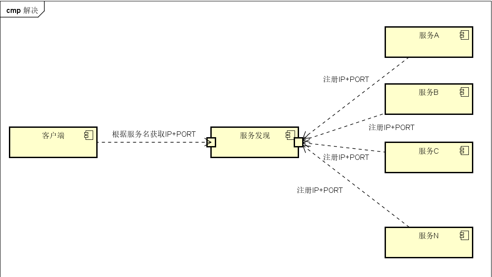

### 服务发现之consul的介绍、部署、使用

#### 什么是服务发现
微服务的框架体系中，服务发现是不得不提的模块。下面看一幅图：

途中客户端的一个接口需要调用A-N服务。客户端必须知道所有服务的网络位置，以往的做法是配置在配置文件中，或有些做法是配置在数据库中。这里会带来一些问题：
1. 需要配置N个服务的网络位置，加大配置的复杂性
2. 服务的网络位置变化，都需要改变每个调用者的配置
3. 集群情况下，难以做负载（使用反向代理的除外）

既然有这些问题，那服务发现是如何处理这些问题的？

与上一张图不同，加了个服务发现模块。

consul是一款提供服务发现的工具

